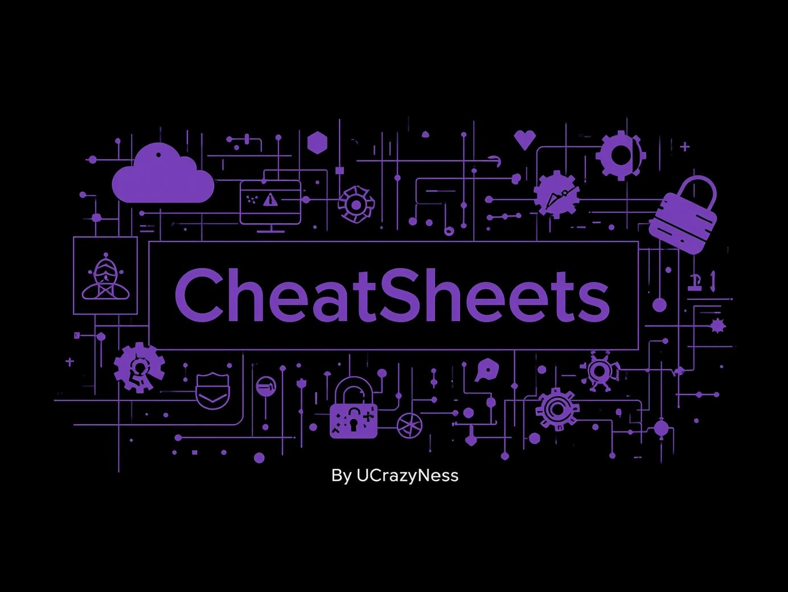

<p align="center">
  
</p>

# 🧠 CheatSheets - Cybersecurity & DevOps

A collection of **cheat sheets and study notes** I’ve created to summarize key concepts in **networking, cybersecurity, DevOps, and security tools**.  
The goal is to make learning and quick referencing easier, organized, and visually clean.

---

## 📂 Repository Structure

| Folder | Description |
|---------|--------------|
| `network/` | Networking fundamentals, OSI, TCP/UDP, routing, ... |
| `security/structure/` | Cybersecurity frameworks and architecture |
| `security/skills/` | Core security skills and practices |
| `security/courses/` | Notes and cheat sheets based on the courses I’ve completed |
| `devops/` | CI/CD, Docker, Kubernetes, GitOps, ... |
| `tools/` | Security tools like Nmap, Burp Suite, Wireshark, ... |
| `myCheat/` | Personal notes and experimental materials, ... |

All cheat sheets are provided in **PDF format**, optimized for desktop and mobile viewing.

---

## 🎓 About These CheatSheets

These cheat sheets are based on courses, labs, and self-study in **cybersecurity and DevOps**.  
They reflect my personal learning journey and summarize concepts from:
- Academic and online courses  
- Hands-on labs and real-world projects  
- Security tools and DevOps workflows  

---

## 🧰 File Format

- Format: `.pdf`  
- Language: English / Farsi (depending on topic)  
- Level: Beginner → Advanced  
- Based on personal study, university courses, and hands-on experience

---

## 🧑‍💻 How to Use

1. Browse into the desired category (e.g., `network/`).
2. Open or download the PDF file you want to read.
3. (Optional) Clone the entire repo for offline access:
   ```bash
   git clone https://github.com/YourUsername/CheatSheets.git
   ```
## ⚙️ License

This project is licensed under the [**CC BY-NC 4.0**](https://creativecommons.org/licenses/by-nc/4.0/) license.  
You may use, share, and adapt the materials for **non-commercial purposes**, as long as proper credit is given.

---

## ⚠️ Disclaimer

> These materials are for **educational and research purposes only**.  
> Please use them responsibly and ethically in accordance with cybersecurity best practices.

